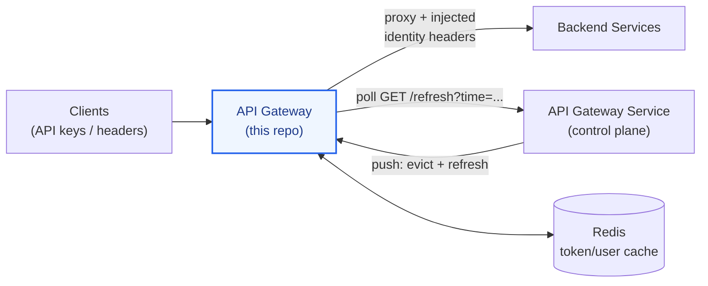

# API Gateway (Data Plane)

[](https://openjdk.org/)
[](https://spring.io/projects/spring-cloud-gateway)
[](https://redis.io/)
[](LICENSE)
[](https://github.com/Nubo-Native-Platform/APILM-APIGW-API-Gateway/actions)

The **data-plane gateway of the Nubo Native Platform (NNP)** — a reactive Spring Cloud Gateway that proxies API traffic, enforces authentication/authorization, and keeps its route table in sync with the control-plane [API Gateway Service](https://github.com/Nubo-Native-Platform/APILM-APIGW-API-Gateway-Service) through a push-and-pull refresh model.

Part of the **API Lifecycle Management (APILM)** area of the Nubo Native Platform.

---

## Key Features

- **Dynamic Route Table**: Route definitions (predicates + filters) are fetched from the control-plane service over REST — no restart needed for route changes.
- **Push & Pull Refresh**: The control plane pushes cache evictions (`/evictRouteCache`, `/refreshRoutes`, `/evictUserCache`, …); this gateway additionally polls the control plane's `GET /refresh?time=` contract on a schedule and self-heals after missed pushes.
- **Request Authentication**: API-key/secret authentication for programmatic callers, backed by a Redis-cached user registry, with header-trust identity (`x-user-name`, `X-User-Type`, `X-Env-Code`) injected into downstream requests.
- **Gateway Filters**: Built-in rate limiting (`replenishRate`), request-size limits (`maxSize`), retry policies, response caching, and secure-header handling.
- **API Analytics & Logging**: Per-call analytics events and a buffered log pipeline (console and/or DB sink).
- **Resilient Boot**: A broken stored route definition does not prevent startup (`fail-on-route-definition-error: false`).
- **GraalVM Native-Image Ready**: Native hints included.

---

## Architecture



| Component | Role | Default |
| :--- | :--- | :--- |
| Spring Cloud Gateway (WebFlux) | Traffic proxy, filter chain | port `8080` |
| Redis | API-user token/value cache | `localhost:6379` |
| API Gateway Service | Control plane: routes, users, refresh contract | HTTP |

---

## Configuration Reference

All configuration lives in a single [`src/main/resources/application.yaml`](src/main/resources/application.yaml); every value is overridable via environment variables.

| YAML key | Environment Variable | Default / Description |
| :--- | :--- | :--- |
| `server.port` | `SERVER_PORT` | `8080` |
| `spring.data.redis.host` / `.port` / `.password` | `SPRING_DATA_REDIS_*` | `localhost:6379`, no password |
| `nnp.apiecosystem.service.url` | `NNP_APIECOSYSTEM_SERVICE_URL` | Control-plane base URL (routes, users, `/refresh`) |
| `nnp.apiecosystem.analytics.service.url` | `NNP_APIECOSYSTEM_ANALYTICS_SERVICE_URL` | Analytics ingestion URL |
| `nnp.apiecosystem.consumer.anonymous.id` | `NNP_APIECOSYSTEM_CONSUMER_ANONYMOUS_ID` | Consumer id for unauthenticated calls |
| `nnp.apiecosystem.domain` | `NNP_DOMAIN` | Optional domain scope |
| `gateway.base.url` | `GATEWAY_BASE_URL` | This gateway's own base URL (used by the refresh scheduler) |
| `gateway.cache.ttl` | `GATEWAY_CACHE_TTL` | Cache TTL in seconds (`30`) |
| `api.logging.enable.*` | `API_LOGGING_*` | Log pipeline switches (console/DB, optional attributes, buffer size) |

---

## Quick Start

**Prerequisites**: JDK 21, Maven 3.9+, Redis, and a reachable control-plane `api-gateway-service`.

```bash
git clone https://github.com/Nubo-Native-Platform/APILM-APIGW-API-Gateway.git
cd APILM-APIGW-API-Gateway

mvn clean verify

export NNP_APIECOSYSTEM_SERVICE_URL='http://localhost:8082'
export GATEWAY_BASE_URL='http://localhost:8080'
export NNP_APIECOSYSTEM_CONSUMER_ANONYMOUS_ID='<consumer-id>'
mvn spring-boot:run
```

## Management & Refresh Endpoints

| Method | Path | Purpose |
| :--- | :--- | :--- |
| `GET` | `/refreshRoutes` | Reload route definitions from the control plane |
| `GET` | `/evictRouteCache` | Evict the cached route table |
| `GET` | `/evictUserCache` | Evict the cached API-user registry |
| `GET` | `/evictAllowedApisForUserCache` | Evict allowed-APIs cache |
| `GET` | `/evictProviderIdByApiIdCache` | Evict provider-mapping cache |

These are the **push targets** the control plane calls after catalog changes; this gateway's own scheduler additionally polls the control plane so missed pushes self-heal.

## Security

- Authentication happens here: API-key/secret callers are verified against the Redis-cached user registry; browser/SSO traffic arrives via the [SSO variant](https://github.com/Nubo-Native-Platform/APILM-APIGW-API-Gateway-SSO) or an upstream identity proxy.
- After authentication, identity headers (`x-user-name`, `X-User-Type`, `X-Env-Code`) are set for downstream services — backends must never trust these headers from direct callers.
- The management/refresh endpoints are for internal infrastructure use; do not expose this gateway's management paths to the public internet.

## Documentation Guides

- **[Local Development](LOCAL_DEVELOPMENT.md)** — setup and runtime notes.

## Contributing

Contributions are welcome under the Apache 2.0 License. Please review [CONTRIBUTING.md](CONTRIBUTING.md) prior to submitting pull requests.

## License

This project is licensed under the [Apache License 2.0](LICENSE).
